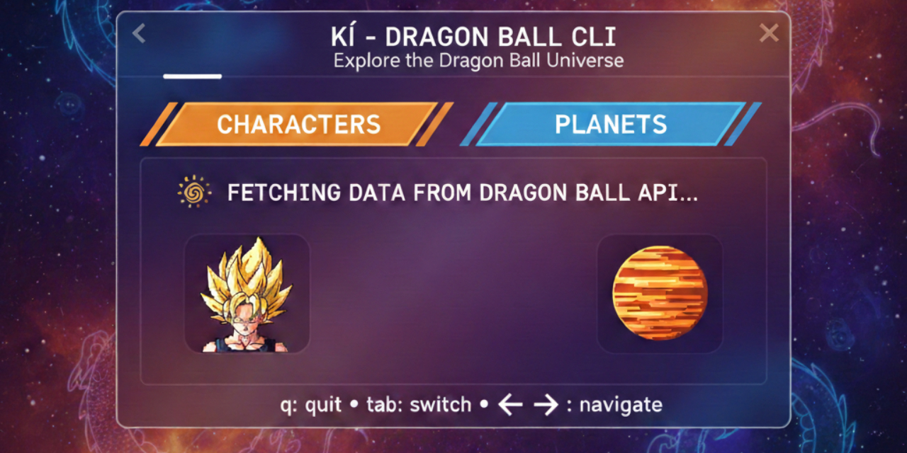

<p align="center">
  
</p>

# 🐉 KI - Dragon Ball CLI TUI

A beautiful Terminal User Interface (TUI) for exploring the Dragon Ball universe, built with Go and Bubble Tea.


[](https://github.com/bilalbaraz/ki/actions)
[](https://codecov.io/gh/bilalbaraz/ki)
[](https://goreportcard.com/report/github.com/bilalbaraz/ki)

## 📋 Table of Contents

- [Features](#-features)
- [Installation](#-installation)
- [Usage](#-usage)
- [Project Structure](#-project-structure)
- [Architecture](#-architecture)
- [API Integration](#-api-integration)
- [Screenshots](#-screenshots)
- [Development](#-development)
- [Contributing](#-contributing)
- [License](#-license)

## ✨ Features

- 🎨 **Beautiful TUI** - Styled with Lipgloss for a modern, colorful interface
- 📊 **Two-Tab Layout** - Browse Characters and Planets separately
- 🔄 **Async Data Fetching** - Non-blocking API calls with loading indicators
- 📄 **Pagination Support** - Navigate through large datasets with ease
- ⌨️ **Keyboard Navigation** - Intuitive controls for quick browsing
- 🎯 **Real-time API Integration** - Fetches data from the Dragon Ball API
- 🚀 **Fast & Responsive** - Built with Go for optimal performance
- ❌ **Error Handling** - Graceful error messages when API is unavailable

## 🚀 Installation

### Prerequisites

- Go 1.25 or higher
- Terminal with 256 color support (recommended)

### Install from Source

```bash
# Clone the repository
git clone https://github.com/bilalbaraz/ki.git
cd ki

# Download dependencies
go mod download

# Build the application
go build -o ki

# Run the TUI
./ki tui
```

### Quick Install

```bash
go install github.com/bilalbaraz/ki@latest
```

## 📖 Usage

### Launch the TUI

```bash
ki tui
```

### Keyboard Controls

| Key | Action |
|-----|--------|
| `Tab` / `Shift+Tab` | Switch between tabs |
| `1` | Jump to Characters tab |
| `2` | Jump to Planets tab |
| `↑` / `k` | Move selection up |
| `↓` / `j` | Move selection down |
| `←` / `p` | Previous page |
| `→` / `n` | Next page |
| `r` | Refresh current tab |
| `q` / `Ctrl+C` | Quit application |

### Command Line

```bash
# Show help
ki --help

# Launch TUI
ki tui

# Show version
ki version
```

## 📁 Project Structure

```
ki/
├── cmd/
│   ├── root.go          # Root Cobra command
│   └── tui.go           # TUI launch command
├── internal/
│   ├── api/
│   │   ├── client.go    # API client for Dragon Ball API
│   │   └── types.go     # Data models (Character, Planet, etc.)
│   └── tui/
│       ├── commands.go  # Tea commands for async operations
│       ├── model.go     # Application state model
│       ├── styles.go    # Lipgloss styles
│       ├── update.go    # Update function (message handling)
│       └── view.go      # View function (rendering)
├── go.mod
├── go.sum
├── main.go
└── README.md
```

## 🏗️ Architecture

### The Elm Architecture (TEA)

This application follows the **Elm Architecture** pattern used by Bubble Tea:

1. **Model** - Application state
2. **Update** - State transitions based on messages
3. **View** - Rendering the UI from current state

### State Management

```go
type Model struct {
    // API client
    client *api.Client
    
    // UI state
    activeTab       Tab
    ready          bool
    
    // Data
    characters     []api.Character
    planets        []api.Planet
    
    // Loading states
    charactersState LoadingState
    planetsState    LoadingState
    
    // Pagination
    currentPage    int
    itemsPerPage   int
}
```

### Message Flow

```
User Input → KeyMsg → Update() → Model State Change → View() → Render
                 ↓
           API Command → goroutine → Response Msg → Update() → Model
```

### Concurrency

All API requests are wrapped in `tea.Cmd` functions that run asynchronously:

```go
func LoadCharactersCmd(client *api.Client, page, limit int) tea.Cmd {
    return func() tea.Msg {
        resp, err := client.GetCharacters(page, limit)
        if err != nil {
            return CharactersErrorMsg{Err: err}
        }
        return CharactersLoadedMsg{Response: resp}
    }
}
```

This ensures the UI remains responsive during API calls.

## 🌐 API Integration

### Dragon Ball API

This application uses the [Dragon Ball API](https://dragonball-api.com):

- **Base URL**: `https://dragonball-api.com/api`
- **Endpoints Used**:
  - `GET /characters?page={page}&limit={limit}` - List characters
  - `GET /planets?page={page}&limit={limit}` - List planets

### Data Models

#### Character

```go
type Character struct {
    ID          int
    Name        string
    Ki          string
    MaxKi       string
    Race        string
    Gender      string
    Description string
    Image       string
    Affiliation string
}
```

#### Planet

```go
type Planet struct {
    ID          int
    Name        string
    IsDestroyed bool
    Description string
    Image       string
}
```

### Error Handling

The application gracefully handles:
- Network timeouts
- API errors (4xx, 5xx)
- JSON decoding errors
- Connection failures

All errors are displayed to the user with helpful messages.

## 🎨 Styling

### Color Palette

The UI uses a Dragon Ball-inspired color scheme:

- **Primary (Orange)**: `#FF6B35` - Energy/Power
- **Secondary (Golden)**: `#F7931E` - Super Saiyan
- **Accent (Cyan)**: `#4ECDC4` - Ki/Aura
- **Background**: `#1A1A2E` - Dark space
- **Error (Red)**: `#FF4757`
- **Success (Green)**: `#2ED573`

### Components

All UI components are styled using Lipgloss:

- Tab bars with active/inactive states
- Bordered content areas
- Styled list items
- Color-coded status indicators
- Loading spinners

## 🛠️ Development

### Running in Development

```bash
# Run without building
go run main.go tui

# Run with race detector
go run -race main.go tui
```

### Testing

```bash
# Run all tests
go test ./...

# Run with coverage
go test -cover ./...

# Run specific package tests
go test ./internal/api/...
```

### Adding New Features

1. **Add API endpoint** in `internal/api/client.go`
2. **Define message types** in `internal/tui/commands.go`
3. **Update model** in `internal/tui/model.go`
4. **Handle messages** in `internal/tui/update.go`
5. **Render UI** in `internal/tui/view.go`

### Code Style

This project follows standard Go conventions:
- `gofmt` for formatting
- `golint` for linting
- Meaningful variable names
- Comprehensive comments

## 📦 Dependencies

- **[Bubble Tea](https://github.com/charmbracelet/bubbletea)** - TUI framework
- **[Lipgloss](https://github.com/charmbracelet/lipgloss)** - Style definitions
- **[Bubbles](https://github.com/charmbracelet/bubbles)** - TUI components (list, spinner)
- **[Cobra](https://github.com/spf13/cobra)** - CLI framework

## 🤝 Contributing

Contributions are welcome! Here's how you can help:

1. Fork the repository
2. Create a feature branch (`git checkout -b feature/amazing-feature`)
3. Commit your changes (`git commit -m 'Add amazing feature'`)
4. Push to the branch (`git push origin feature/amazing-feature`)
5. Open a Pull Request

### Ideas for Contributions

- [ ] Add character details view
- [ ] Add search/filter functionality
- [ ] Add transformations tab
- [ ] Add export to JSON/CSV
- [ ] Add favorites/bookmarks
- [ ] Add keyboard shortcuts customization
- [ ] Add config file support
- [ ] Add caching for offline viewing

## 📄 License

This project is licensed under the MIT License - see the [LICENSE](LICENSE) file for details.

## 🙏 Acknowledgments

- **Dragon Ball API** - For providing the awesome API
- **Charm** - For the incredible TUI libraries
- **Akira Toriyama** - For creating Dragon Ball

## 📞 Contact

- **Author**: Bilal Baraz
- **GitHub**: [@bilalbaraz](https://github.com/bilalbaraz)
- **Project**: [ki](https://github.com/bilalbaraz/ki)

---

Made with ❤️ and ☕ by Dragon Ball fans, for Dragon Ball fans.

**Over 9000!** 💪
